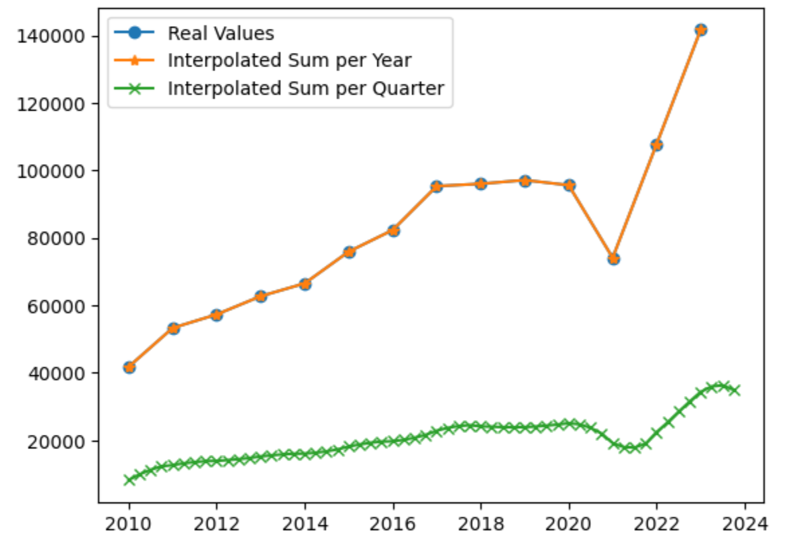
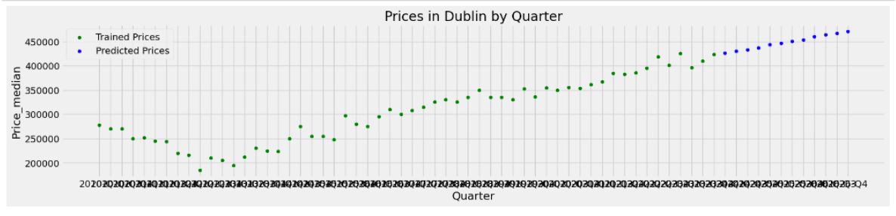

# Capstone Project (Deciphering the Irish Housing Market: Data-Driven Insights into Past Trends, Present Realities, and Future Projections)

## Step 1) Data Scrağing from Property Price Register (PPR) of Ireland
See [data_scraping](./data_scraping/Script.ipynb) for more details.

Scraped PPR website which displays a table per county and year with 250 results in each page. Iterated all pages for given county and year at a time until all pages are scraped, and iterated all other counties and years in scope. [Scraped property data](./data_scraping/property_sales.csv) have Full Date, Year, County, Price, and Full Address columns.

## Step 2) Data Transformation and Merging
See [data_merge](./data_merge/data_merge.ipynb) for more details.

Reads scraped property_sales data from Step 1, and collected secondary data from [secondary_data](./data_merge/secondary_data) and merges in single dataset.

Since primary data is daily, but secondary data is anually or even less frequent, we used [scipy.CubicSpline](https://docs.scipy.org/doc/scipy/reference/generated/scipy.interpolate.CubicSpline.html#scipy.interpolate.CubicSpline) to interpolate quarterly data based on annual data.

In the end, we created a [merged_dataset](./data_merge/merged_dataset.csv) that has the quarter and county with data merged from secondary data.

## Step 3) Machine Learning
See [machine_learning](./machine_learning/machine_learning.ipynb) for more details.

Tested machine learning models with splitting data into training (before 2019) and testing (after 2019) data and found that [Ridge regression model](https://scikit-learn.org/stable/modules/generated/sklearn.linear_model.Ridge.html) is the best model for our use case.

After parameter tuning, we predicted future values of the features and finally predicted a forecast of housing prices in Ireland.

